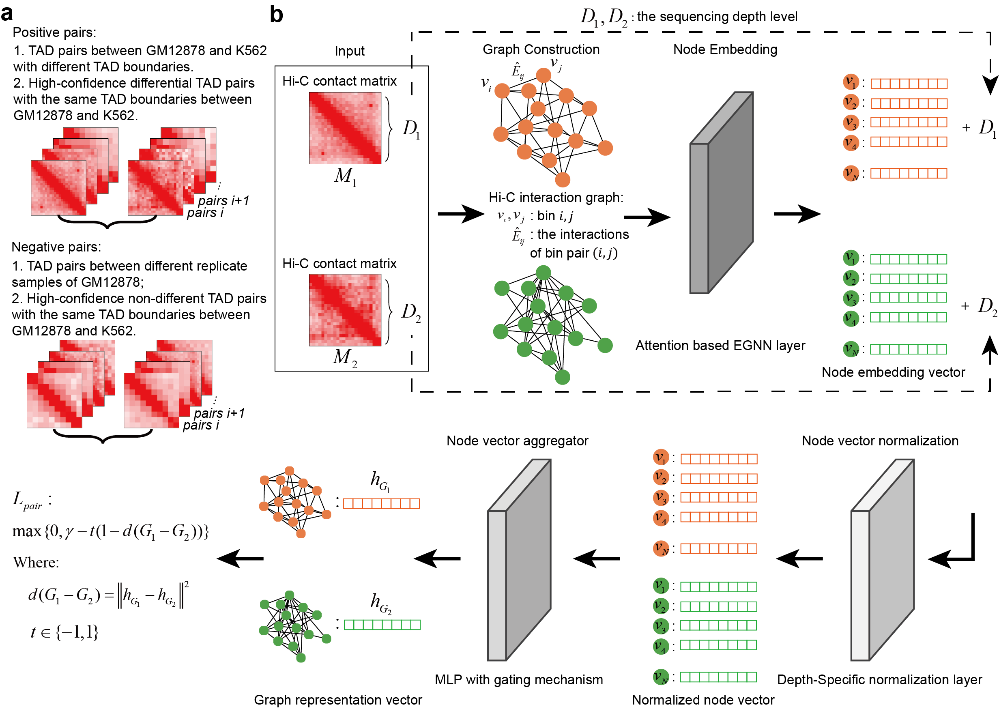

# HiDT
**Robust identification of differential topologically associating domains from three-dimensional genome maps.**  
We present HiDT, a graph neural network-based algorithm with an attention-based, edge-enhanced layer to capture structural differences between TAD graphs. HiDT integrates a depth-specific normalization module and is trained across diverse sequencing depths, enabling robust detection of differential TADs under sparse conditions. Comprehensive benchmarking demonstrates that HiDT consistently outperforms existing methods at both TAD and sub-TAD levels, maintaining accuracy even in datasets with only a few million contacts. By overcoming the limitations of sparse data, HiDT enabled analyses previously difficult in low-coverage datasets. Specifically, we applied it to map TAD reorganization linked to oncogene dysregulation during tumor progression, profile differential TADs associated with transcriptional heterogeneity among cell subtypes in single-cell Hi-C data, and define haplotype-specific TADs associated with allele-specific structural variations.

# Installation
## Install HiDT
HiDT and the dependencies can be installed using pip:
   ```text
   $ conda config --add channels defaults
   $ conda config --add channels bioconda
   $ conda config --add channels conda-forge
   $ conda create -n HiDT python=3.7
   $ conda activate HiDT
   $ pip install -U hidt
   ```
## Install Pytorch
Our algorithm, HiDT, is implemented using the PyTorch framework. If you have a GPU, you can install PyTorch with CUDA support to speed up processing. But HiDT is not computationally intensive, so running on CPU is also fast and works well.
If you **do not** have CUDA installed (CPU version), simply run:    
   ```text
   $ pip install torch==1.13.1
   ```
If you **have** CUDA installed (GPU version), you need to select the CUDA version supported by your system. You can visit the [CUDA Toolkit Archive](https://developer.nvidia.com/cuda-toolkit-archive) to find the appropriate version. Then install the matching GPU version of PyTorch. For example, to install PyTorch 1.13.1 with CUDA 11.7 using pip:  
   ```text
   $ pip install torch==1.13.1+cu117 -f https://download.pytorch.org/whl/torch_stable.html
   ```
# HiDT Usage
   ```text
   $ HiDT
   usage: HiDT [-h] [--hicfile1 HICFILE1] [--hicfile2 HICFILE2]
            [--TADfile TADFILE] [--res RES] [--depth DEPTH] [--output OUTPUT]

   Identify differential TADs from Hi-C contact maps.

   optional arguments:
   -h, --help           show this help message and exit
   --hicfile1 HICFILE1  Hi-C file (in .hic format) for condition 1. (default:
                       None)
   --hicfile2 HICFILE2  Hi-C file (in .hic format) for condition 2. (default:
                       None)
   --TADfile TADFILE    TAD boundary file used for differential analysis.
                       (default: None)
   --res RES            Resolution of the Hi-C contact maps (e.g., 25000 for 25
                       kb). (default: None)
   --depth DEPTH        Method to compute sequencing depth: "intra" for intra-
                       chromosomal counts or "total" for all contacts.
                       (default: intra)
   --output OUTPUT      Path to the output result file. (default: None)
   ```
## Input Requirements

HiDT requires **two Hi-C files** in `.hic` format representing the two conditions you need to compare, and a **TAD file** specifying the domains to analyze.

- The **TAD file** must:
  - Include a header row
  - Have the **first three columns** corresponding to:
    1. Chromosome
    2. Start coordinate
    3. End coordinate
- The **resolution** (`--res`) should match one of the available resolutions in your .hic files (e.g., 50000 for 50 Kb).
- **Sequencing depth calculation** (`--depth`) has two options:
  - `intra`: Counts only intra-chromosomal contacts (default)
  - `total`: Counts both intra- and inter-chromosomal contacts

> **Tip:** Using `intra` mode is strongly recommended to improve runtime.

- If your Hi-C data is not in `.hic` format (e.g., `.cool`), you can convert it using [hictk](https://github.com/paulsengroup/hictk) or other tools before running HiDT.
## Quick start
First, download the testdata folder from our GitHub repository. It contains example data:

- `Cortical_L2_5_Pyramidal_Cell.hic` and `Cortical_L6_Pyramidal_Cell.hic`: pseudo-bulk Hi-C data for two mouse brain cell subtypes

- `Cortical_L2_5_Pyramidal_Cell.bed`: a corresponding TAD file

Then, use HiDT to identify differential TADs by running the following command:
```text
    $ HiDT --hicfile1 /path/to/testdata/Cortical_L2_5_Pyramidal_Cell.hic \
           --hicfile2 /path/to/testdata/Cortical_L6_Pyramidal_Cell.hic \
           --TADfile /path/to/testdata/Cortical_L2_5_Pyramidal_Cell.bed \
           --res 50000 \
           --output /path/to/output_results.txt
```
## Output
The HiDT output file contains four columns:

| Column | Description                           |
|--------|---------------------------------------|
| chrom  | Chromosome name                      |
| start  | TAD start position                   |
| end    | TAD end position                     |
| score  | Differential score computed by HiDT  |

TADs with a **score > 1** are identified as differential TADs.


